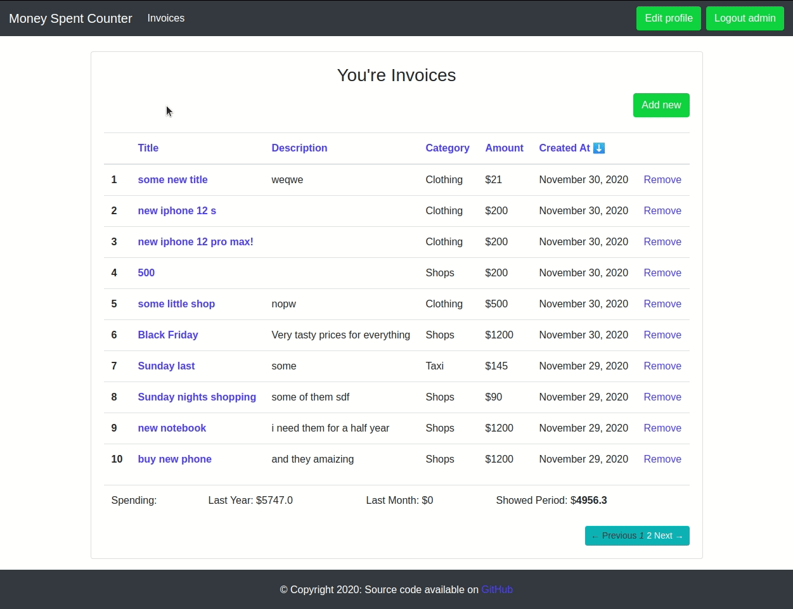

<h1 align="center"> Money Spent Counter </h1>
<p align="center">
Test task to check basic knowledge of Ruby. Here implemented, registration based on Device, sorting by column name, basic Bootstrap style and tests on RSpec.
</p>

## Table of Contents

- [Introduction](#introduction)
- [Features](#features)
- [Getting started](#getting-started)
- [Feedback](#feedback)

<!-- END doctoc generated TOC please keep comment here to allow auto update -->

## Introduction

Money Spent Counter a minimal expenses tracking application using Ruby on Rails framework. Deployed to Heroku and available [online](https://money-spent-counter.herokuapp.com/).


## Features

In the application you can:

* Register to app or login  
* Create new invoice with title, description, category and amount  
* Show all user invoices paginated by 10 pear page and sorting option  
* Ability to copy invoice link and send them to another user
* Handle all errors like not found to default 404 page

## Getting started

##### Prerequisites

The setups steps expect following tools installed on the system.

- Github
- Ruby [2.6.3](https://www.ruby-lang.org/en/news/2019/04/17/ruby-2-6-3-released/)
- Rails [5.2.4.3](https://weblog.rubyonrails.org/2020/5/18/Rails-5-2-4-3-and-6-0-3-1-have-been-released/)
- PostgreSQL >= 9.3

##### 1. Check out the repository

```bash
git clone https://github.com/Synkevych/money_spent_counter.git
cd money_spent_counter
```

##### 2. Create and setup the database, bundle and yarn

Run the following commands to create and setup the database, and application libraries.

```ruby
rails db:create
rails db:setup
rails db:migrate
rails db:seed # for create some default data

bundle install

yarn install
```

##### 3. Start the Rails server

You can start the rails server using the command given below.

```ruby
rails s
```

And now you can visit the site with the URL http://localhost:3000

##### 4. Running specs tests

You can run all **60 tests**(coverage 88.17%) using the command given below.

```bash
$ rails generate rspec:install  # first setup rspec gem
$ rspec spec

# Default: Run all spec files (i.e., those matching spec/**/*_spec.rb)
$ rspec

# Run all spec files in a single directory (recursively)
$ rspec spec/models

# Run a single spec file
$ rspec spec/requests/invoices_request_spec.rb

# Run a single example from a spec file (by line number)
$ rspec spec/requests/invoices_request_spec.rb:43

# See all options for running specs
$ rspec --help

# another useful commands
$ rails g rspec:controller users # generate new test for controller  
$ rails g rspec:model user # generate new test for model
```

##### 5. Deployment to Heroku instructions

`heroku login` - login to your profile  
`heroku create money-spent-counter` - create new heroku app with specific name  
`heroku buildpacks:add --index 1 heroku/nodejs` - because of yarn lib you need use Multiple Buildpacks
`git push heroku main` - push you project to Heroku server  
`heroku run rake db:migrate` - run migration on Heroku server  
`heroku pg:reset` - drop database on Heroku server  
`heroku open` - open and test your website  

## Feedback

Feel free to send me feedback on [Twitter](https://twitter.com/synkevych) or [file an issue](https://github.com/Synkevych/money_spent_counter/commits/issues/new). Feature requests are always welcome.
